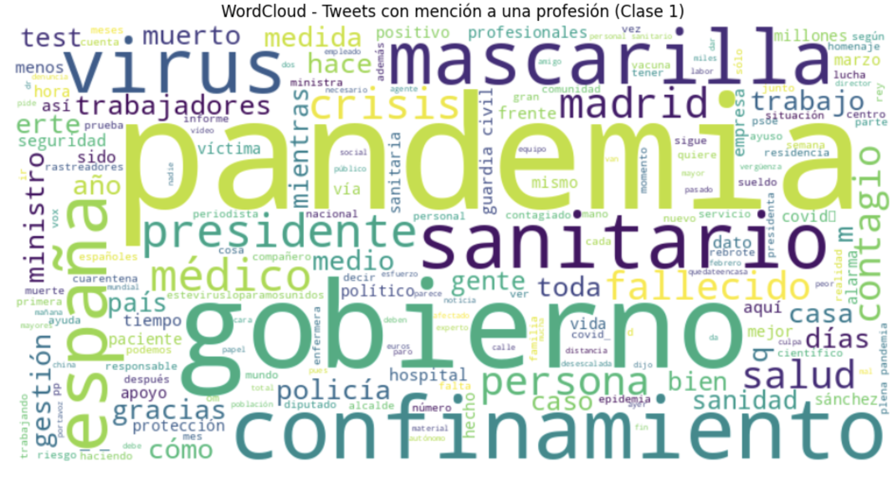
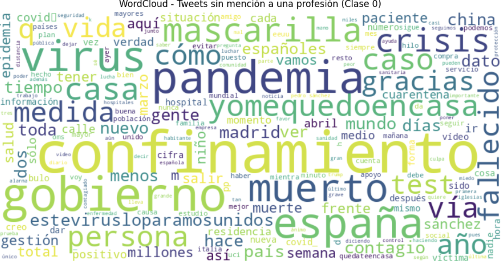

# 📱Profession Mention Detection in Spanish Tweets using BERT

A Natural Language Processing (NLP) project that fine-tunes a transformer-based language model to automatically detect whether a Spanish tweet contains a mention of a profession. The project includes exploratory text analysis, data preprocessing, model training, and evaluation using standard classification metrics.

---

## Project Overview

This project tackles a binary text classification problem using a pretrained BERT model for Spanish.

The objective is to classify tweets into one of two categories:

- **Class 1:** The tweet contains a mention of a profession.
- **Class 0:** The tweet does not contain a profession mention.

The project covers the complete NLP workflow, from exploratory data analysis and preprocessing to transformer fine-tuning and model evaluation.

---

## Dataset
The project uses the [**PROFNER**](https://huggingface.co/datasets/luisgasco/profner_classification_master) dataset, a benchmark dataset designed for profession detection in Spanish tweets.

---

## Exploratory Data Analysis

Before training the model, an exploratory analysis was performed to understand the vocabulary associated with each class.

### Tweets mentioning a profession (Class 1)



### Tweets without profession mentions (Class 0)



The word clouds highlight the most frequent terms appearing in each class and provide insight into the linguistic patterns learned by the model.

---

## Project Workflow

- Dataset loading from Hugging Face
- Text preprocessing
- Tokenization using a pretrained Spanish BERT tokenizer
- Fine-tuning a transformer model
- Model evaluation
- Prediction generation

---

## Technologies

- Python
- Hugging Face Transformers
- Hugging Face Datasets
- PyTorch
- Scikit-learn
- Pandas
- Matplotlib
- WordCloud

---

## Repository Structure

```text
.
├── profession_detection.ipynb
├── README.md
├── requirements.txt
├── images/
    ├── wordcloud_class0.png
    └── wordcloud_class1.png
```

---

## Installation

Install the required packages:

```bash
pip install -r requirements.txt
```

---

## Requirements

```text
transformers
datasets
torch
scikit-learn
pandas
numpy
matplotlib
wordcloud
jupyter
```

---

## Model

The project fine-tunes a pretrained Spanish BERT model using the Hugging Face Transformers library for binary text classification.

The model is trained using supervised learning and evaluated on a held-out test set using standard classification metrics.

